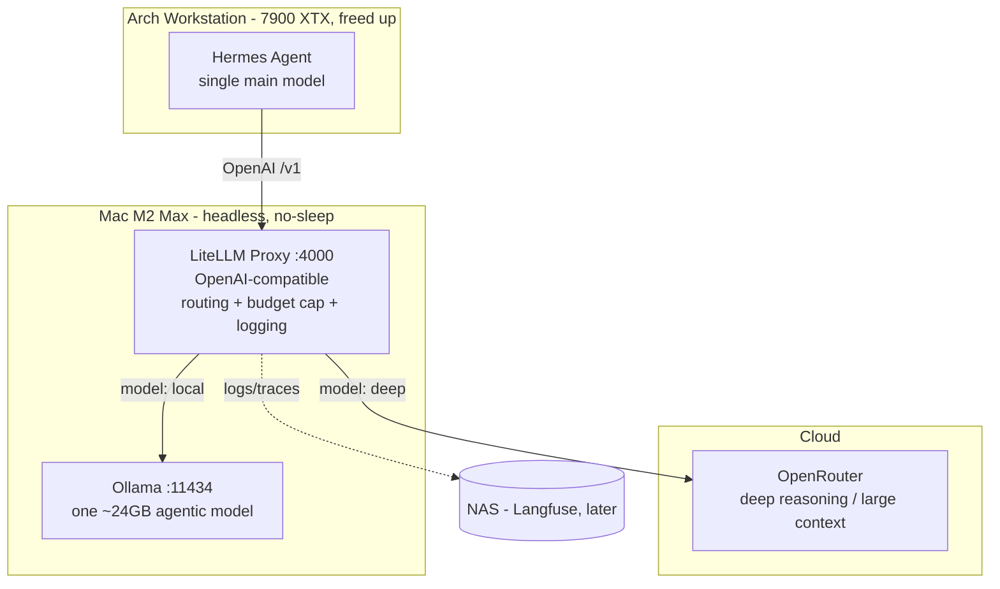

# Hybrid Local/Cloud AI Agent Setup

A hybrid AI-agent infrastructure that keeps routine work **local, free, and private** while reaching **cloud reasoning** only for genuinely hard tasks — with a hard cost ceiling and full visibility into which model handled what.

> **Status:** design approved, implementation not yet started. See the [design spec](docs/superpowers/specs/2026-05-20-hybrid-ai-routing-design.md) and the [decision journal](docs/journal/).

## The idea

[Hermes Agent](https://hermes-agent.nousresearch.com) runs on the Arch Linux workstation, but all model inference is offloaded to a headless **Mac M2 Max (32 GB)**. A **LiteLLM gateway** on the Mac routes each request either to a **local Ollama model** (routine work) or to **OpenRouter** (deep business research). This frees the workstation GPU, keeps everyday tasks at €0, and bounds cloud spend with a hard monthly cap.

## Architecture

## Components

| Component | Location | Role |
|---|---|---|
| Hermes Agent | Arch workstation | Agent brain: skills, memory, email gateway. Single main model → the gateway. |
| LiteLLM Proxy | Mac M2 Max (`:4000`) | OpenAI-compatible gateway: routing, **€100/mo** budget cap, token cap, logging. |
| Ollama | Mac M2 Max (`:11434`) | One ~24 GB agentic model for routine work. |
| OpenRouter | Cloud | Deep reasoning / large context for business research. |
| Observability | Mac → NAS | LiteLLM dashboard (`:4000/ui`) now; Langfuse on the NAS later. |

## How routing works

Cloud cost is bounded by a hard cap, so routing is chosen for **reliability**, not to police spend:

1. **Default → local.** Routine tasks and email triage run on the local model, free.
2. **Capability fallback.** If a prompt is too large for the local model, LiteLLM auto-routes it to cloud (a capability fact, not a guess).
3. **Triage advisor.** When unsure, a Hermes skill asks the *local* model "deep or local?" and recommends; you confirm. (Starts in recommend-mode; can become automatic later.)
4. **Explicit cloud.** `/model deep`, or a cloud-pinned research subagent, for confirmed heavy research.
5. **Backstop.** A hard **€100/month** budget cap + per-request token cap. At the cap, cloud is blocked with a clear error; local routine continues.

## Why hybrid (the economics)

A local high-end multi-GPU rig is hard to justify against German electricity prices (~€0.37/kWh) versus modern cloud token pricing. This setup spends €0 hardware, runs the Mac as a low-idle always-on server, and pays only cents-per-task for the rare heavy job — with a hard ceiling so a runaway agent loop can't drain credit.

## Implementation phases

The routing layer (LiteLLM) is the centerpiece and ships first.

1. **Routing in place:** Mac prep + Ollama (`pmset`, `OLLAMA_HOST`, pull model); LiteLLM gateway with `local` + `deep` routes, €100/mo budget cap, token cap, context fallback, dashboard; wire Hermes (default local, `/model deep` → cloud).
2. Triage advisor skill (recommend / local-judge).
3. Langfuse on the NAS.
4. *(Deferred)* Presidio anonymization + GDPR hardening — treated as risk-reduction, never a compliance guarantee.

## Repository layout

- `docs/superpowers/specs/` — design specs
- `docs/journal/` — dated decision log (the "why", and the story for a talk)
- `docs/runbook.md` — how to operate the system (added during implementation)
- `CLAUDE.md` — working conventions
