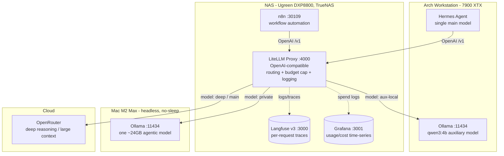

# Hybrid Local/Cloud AI Agent Setup

A hybrid AI-agent infrastructure with a **fast cloud brain** for everyday speed, an **on-device model** for work that must stay private or free, and **frontier reasoning** for genuinely hard tasks — with a hard cost ceiling and full visibility into which model handled what.

> **Status:** Phase 1 (routing gateway) complete; routes redesigned to role-based names (`main`/`private`/`deep`) with a fast-cloud default brain — see the [redesign spec](docs/superpowers/specs/2026-05-20-model-route-roles-redesign.md). Phase 2 (triage advisor) — script + judge verified live; Hermes-side integration pending. See the [decision journal](docs/journal/).

## The idea

[Hermes Agent](https://hermes-agent.nousresearch.com) runs on the Arch Linux workstation, but all model inference is offloaded — the heavy `private` model to a headless **Mac M2 Max (32 GB)**. A **LiteLLM gateway** on the **NAS** (Ugreen DXP8800 Plus, TrueNAS) makes a cheap cloud model (**DeepSeek V4 Flash**) the agent's default brain, drops to the **local Ollama model on the Mac** only when privacy or €0 is worth its latency, and escalates to a **frontier model** (Gemini 3.1 Pro) for heavy research. Hosting the gateway on the always-on services NAS (alongside Langfuse for per-request traces and Grafana for usage/cost time-series) frees the workstation GPU, keeps a hard monthly cap on cloud spend, and keeps sensitive workflows (email triage) on-device.

## Architecture

## Components

| Component | Location | Role |
|---|---|---|
| Hermes Agent | Arch workstation | Agent brain: skills, memory, email gateway. Single main model → the gateway. |
| LiteLLM Proxy | NAS (`10.63.0.2:4000`) | OpenAI-compatible gateway: routing, **€100/mo** budget cap, token cap, logging. Dockge stack on TrueNAS. Routes are DB-backed (`store_model_in_db`) — swap a route's model live in the UI, no redeploy; git-tracked seed at `nas/models.seed.json`. |
| Ollama | Mac M2 Max (`:11434`) | One ~24 GB agentic model — the `private` route (privacy / €0 / bulk); also runs the weekly `curator` aux task. Listens on the LAN for the NAS gateway. |
| Ollama | Arch workstation (`:11434`) | Local `qwen3:4b-instruct-2507` — the `aux-local` route for Hermes' hot-path aux tasks (titles, profiles, Kanban specs). On-device, €0. (`compression` routes to cloud `main`: its window must ≥ the main model's — see runbook.) |
| OpenRouter | Cloud | `main` (DeepSeek V4 Flash default brain) + `deep` (Gemini 3.1 Pro) / `deep-fallback` (GPT-5) for frontier research. |
| Langfuse v3 | NAS (`10.63.0.2:3000`) | Per-request traces: prompt, response, tokens, cost. Primary observability view for qualitative drill-down. |
| Grafana | NAS (`10.63.0.2:3001`) | Usage/cost time-series: gateway spend vs. $100 cap and local-vs-cloud split (reads `LiteLLM_SpendLogs` via read-only Postgres role); Claude Code subscription token/cost via OTel. Quantitative complement to Langfuse traces. |
| LiteLLM dashboard | NAS (`:4000/ui`) | Quick spend / latency fallback view; co-located with the gateway. |
| n8n | NAS (`10.63.0.2:30109`) | Workflow automation. TrueNAS community/TrueCharts app (the one service not on Dockge). All LLM calls go through the gateway, so they're traced and €100-capped automatically. Workflows built in-UI. |

## How routing works

Cloud cost is bounded by a hard cap, so routing is chosen for **reliability**, not to police spend:

1. **Default → main.** Orchestration and routine work run on the cheap cloud brain (DeepSeek V4 Flash). The slow local model is *not* the default — it takes ~2 min even for trivial turns.
2. **Private on demand.** Sensitive or bulk work routes to the local `private` model (free, on-device); email triage is pinned there.
3. **Triage advisor.** When unsure, a Hermes skill asks the `main` model "main, private, or deep?" and recommends; you confirm. (Recommend-only; can become automatic later.)
4. **Explicit deep.** `/model deep`, or a cloud-pinned research subagent, for confirmed heavy research.
5. **Backstop.** A hard **€100/month** cloud cap (split `main` $50 / `deep` $35 / `deep-fallback` $15). At the cap, `main` degrades to `private` so the agent keeps working; `private` is free and uncapped.

## Why hybrid (the economics)

A local high-end multi-GPU rig is hard to justify against German electricity prices (~€0.37/kWh) versus modern cloud token pricing. This setup spends €0 hardware, runs the Mac as a low-idle always-on server, and pays only cents-per-task for the rare heavy job — with a hard ceiling so a runaway agent loop can't drain credit.

## Implementation phases

The routing layer (LiteLLM) is the centerpiece and ships first.

1. **Done (routes redesigned).** Routing in place: Mac prep + Ollama; LiteLLM gateway with role-based routes — `main` (DeepSeek V4 Flash brain), `private` (local), `deep` (Gemini 3.1 Pro) / `deep-fallback` (GPT-5) — €100/mo split cap, token cap, dashboard; wire Hermes (default `main`, `/model deep`/`/model private`). Routes re-picked on price + tool-use (tau2) data 2026-05-22.
2. **Script verified; Hermes integration pending.** Triage advisor skill (recommend / local-judge) — see [runbook § Triage advisor](docs/runbook.md#triage-advisor-phase-2).
3. **Done (verified live 2026-05-22).** Langfuse v3 on the NAS — per-request traces (prompt, response, tokens, cost) at `http://10.63.0.2:3000`; gateway ships them via async `success_callback`. End-to-end trace round-trip confirmed.
4. **Done (2026-05-22).** Grafana usage/cost metrics on the NAS — time-series spend vs. the $100 cap at `http://10.63.0.2:3001`; gateway data from `LiteLLM_SpendLogs` (Postgres, read-only `grafana_ro` role); Claude Code subscription data via OTel collector (`arch/claude-code-otel.sh` → `:4318` → Prometheus → Grafana). Builds the accruing cost history needed for the talk.
5. **Done (2026-05-22).** n8n on the NAS — workflow automation host at `http://10.63.0.2:30109` (TrueNAS community app). Gateway round-trip verified; LLM calls trace + cap automatically. Workflows built in-UI; see [`nas/n8n/README.md`](nas/n8n/README.md).
6. *(Deferred)* Presidio anonymization + GDPR hardening — treated as risk-reduction, never a compliance guarantee.

## Repository layout

- `docs/superpowers/specs/` — design specs
- `docs/journal/` — dated decision log (the "why", and the story for a talk)
- `docs/runbook.md` — how to operate the system
- **`nas/`** — NAS service docs (TrueNAS): LiteLLM gateway stack (Dockge), plus `langfuse/`, `metrics/`, and `n8n/` (community app install spec).
- **`mac/`** — Mac side: Ollama (`private` model); previous gateway stack, kept for rollback.
- **`arch/`** — Arch side: `aux-local` Ollama + the nftables guard around `:11434`.
- `CLAUDE.md` — working conventions
- **`pricing/`** — OpenRouter price + Artificial Analysis quality tracker; snapshots to committed CSVs for accurate, dated cost comparisons (see [`pricing/README.md`](pricing/README.md)).
