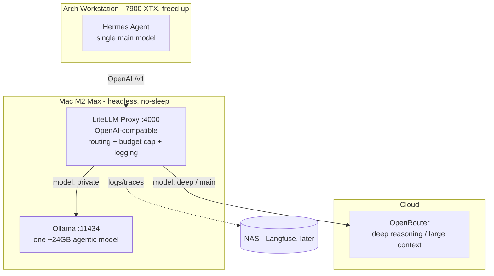

# Hybrid Local/Cloud AI Agent Setup

A hybrid AI-agent infrastructure with a **fast cloud brain** for everyday speed, an **on-device model** for work that must stay private or free, and **frontier reasoning** for genuinely hard tasks — with a hard cost ceiling and full visibility into which model handled what.

> **Status:** Phase 1 (routing gateway) complete; routes redesigned to role-based names (`main`/`private`/`deep`) with a fast-cloud default brain — see the [redesign spec](docs/superpowers/specs/2026-05-20-model-route-roles-redesign.md). Phase 2 (triage advisor) — script + judge verified live; Hermes-side integration pending. See the [decision journal](docs/journal/).

## The idea

[Hermes Agent](https://hermes-agent.nousresearch.com) runs on the Arch Linux workstation, but all model inference is offloaded to a headless **Mac M2 Max (32 GB)**. A **LiteLLM gateway** on the Mac makes a fast cloud model (**GPT-5-mini**) the agent's default brain for speed, drops to a **local Ollama model** only when privacy or €0 is worth its latency, and escalates to a **frontier model** (GPT-5) for heavy research. This frees the workstation GPU, keeps a hard monthly cap on cloud spend, and keeps sensitive workflows (email triage) on-device.

## Architecture

## Components

| Component | Location | Role |
|---|---|---|
| Hermes Agent | Arch workstation | Agent brain: skills, memory, email gateway. Single main model → the gateway. |
| LiteLLM Proxy | Mac M2 Max (`:4000`) | OpenAI-compatible gateway: routing, **€100/mo** budget cap, token cap, logging. |
| Ollama | Mac M2 Max (`:11434`) | One ~24 GB agentic model — the `private` route (privacy / €0 / bulk). |
| OpenRouter | Cloud | `main` (GPT-5-mini default brain) + `deep`/`deep-fallback` (frontier research). |
| Observability | Mac → NAS | LiteLLM dashboard (`:4000/ui`) now; Langfuse on the NAS later. |

## How routing works

Cloud cost is bounded by a hard cap, so routing is chosen for **reliability**, not to police spend:

1. **Default → main.** Orchestration and routine work run on the fast cloud brain (GPT-5-mini). The slow local model is *not* the default — it takes ~2 min even for trivial turns.
2. **Private on demand.** Sensitive or bulk work routes to the local `private` model (free, on-device); email triage is pinned there.
3. **Triage advisor.** When unsure, a Hermes skill asks the `main` model "main, private, or deep?" and recommends; you confirm. (Recommend-only; can become automatic later.)
4. **Explicit deep.** `/model deep`, or a cloud-pinned research subagent, for confirmed heavy research.
5. **Backstop.** A hard **€100/month** cloud cap (split `main` $50 / `deep` $35 / `deep-fallback` $15). At the cap, `main` degrades to `private` so the agent keeps working; `private` is free and uncapped.

## Why hybrid (the economics)

A local high-end multi-GPU rig is hard to justify against German electricity prices (~€0.37/kWh) versus modern cloud token pricing. This setup spends €0 hardware, runs the Mac as a low-idle always-on server, and pays only cents-per-task for the rare heavy job — with a hard ceiling so a runaway agent loop can't drain credit.

## Implementation phases

The routing layer (LiteLLM) is the centerpiece and ships first.

1. **Done (routes redesigned).** Routing in place: Mac prep + Ollama; LiteLLM gateway with role-based routes — `main` (GPT-5-mini brain), `private` (local), `deep`/`deep-fallback` (frontier) — €100/mo split cap, token cap, dashboard; wire Hermes (default `main`, `/model deep`/`/model private`).
2. **Script verified; Hermes integration pending.** Triage advisor skill (recommend / local-judge) — see [runbook § Triage advisor](docs/runbook.md#triage-advisor-phase-2).
3. Langfuse on the NAS.
4. *(Deferred)* Presidio anonymization + GDPR hardening — treated as risk-reduction, never a compliance guarantee.

## Repository layout

- `docs/superpowers/specs/` — design specs
- `docs/journal/` — dated decision log (the "why", and the story for a talk)
- `docs/runbook.md` — how to operate the system
- `CLAUDE.md` — working conventions
