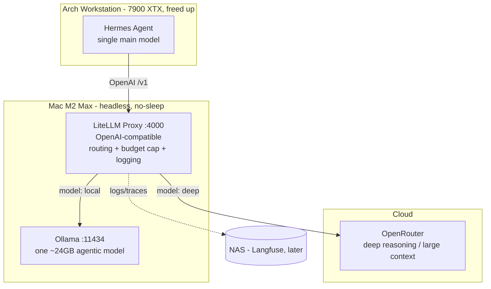

# Hybrid Local/Cloud AI Agent Setup — Design Spec

- **Date:** 2026-05-20
- **Status:** Approved (design phase) — implementation not started
- **Owner:** DerTechie

## 1. Purpose & Goals

Optimize a local AI agent (Hermes Agent) setup so that it:

- Offloads model inference from the Arch Linux workstation (AMD Radeon RX 7900 XTX) to a headless Mac M2 Max (32 GB), keeping the workstation free of inference load and freezes.
- Runs routine tasks (email triage, "alert me on a real business inquiry", daily summaries) **locally** — free and private.
- Routes heavy business research (market analysis, strategic positioning, project-vs-market analysis) to a **capable cloud model** when local quality is insufficient.
- Makes routing **reliable**, cloud cost **hard-bounded**, and the model choice **observable**.
- Persists the build path so it can be reconstructed later for Obsidian notes and a future talk.

**Non-goals (deferred):** GDPR / Microsoft Presidio anonymization. Revisit once there is a real customer or genuinely sensitive third-party data in play. Treat masking as risk-reduction, never as a compliance guarantee.

## 2. Components

| Component | Location | Role |
|---|---|---|
| Hermes Agent | Arch workstation | The agent brain: skills, memory, email gateway. Single main model pointed at the gateway. |
| LiteLLM Proxy | Mac M2 Max (`:4000`) | OpenAI-compatible gateway. Routes by model name, enforces budget + token caps, logs every call. |
| Ollama | Mac M2 Max (`:11434`) | Runs **one** ~24 GB agentic model locally. |
| OpenRouter | Cloud | Deep reasoning / large context for business research. |
| LiteLLM dashboard | Mac (`:4000/ui`) | Initial observability — model chosen, tokens, cost, latency. |
| Langfuse | NAS (Docker), later | OpenTelemetry-based observability upgrade (per-request traces). |

## 3. Key constraints & findings

- **Hermes uses ONE main model per profile**, fixed at startup. There is **no native automatic task-difficulty routing** (open, unimplemented feature request [NousResearch/hermes-agent#4461](https://github.com/NousResearch/hermes-agent/issues/4461)). Ways to use another model: `/model` switch + aliases, subagent delegation, auxiliary task slots (side-tasks only). **Therefore the routing decision lives in the gateway and in explicit user/agent choices — not in Hermes auto-detecting difficulty.**
- **Hermes connects via an OpenAI-compatible endpoint.** Both Ollama and OpenRouter also speak OpenAI format, so the gateway is a thin router, not a protocol translator.
- **32 GB unified memory** realistically runs **one** ~24 GB agentic model; macOS overhead + KV cache consume the rest. No room for a second resident "router" model — so no local LLM-classifier on the hot path.
- **Model tier matters more than the README implied.** A 4B model was inadequate in prior testing; 14B is mediocre for agentic/tool use; the realistic, capable ceiling on this hardware is the **~24 GB agentic Qwen tier** (Ollama lists a `qwen3.6`-class model here — confirm exact tag at setup).

## 4. Architecture

## 5. Routing design

Cost is bounded independently (Section 6), so routing is chosen for **reliability**, not to police spend. Layers:

1. **Default = local.** Routine + email triage run on the local model. Automatic, €0.
2. **Capability auto-fallback.** LiteLLM `context_window_fallbacks`: if a prompt is too large for the local model, it routes to cloud automatically. Reliable because it is a capability fact, not a difficulty guess.
3. **Triage advisor (Hermes skill).** When unsure, ask "deep or local, and why?" The **local model** judges and **recommends**; the user confirms. Start in *recommend / local-judge* mode; reversible to auto-route once its judgment is trusted (observe via the dashboard).
4. **Explicit cloud.** `/model deep` alias, or a **cloud-pinned research subagent** Hermes delegates the heavy step to (which also scopes cloud spend to that step rather than a whole session).
5. **Backstop.** Hard budget cap + per-request token cap (Section 6).

**Rejected:** gateway guessing difficulty from raw prompt text (unreliable — the exact cause of "dumb local answer"); pure manual selection with no cap (human over-biases to cloud → cost).

## 6. Cost control

- Cloud budget is scoped to the **`deep` model only** (`max_budget: 100` USD + `budget_duration: 30d` in its `litellm_params`), **not** the global `litellm_settings.max_budget`. The global budget blocks *all* requests — including the free `local` model — once total spend crosses it (verified the hard way during implementation), which we explicitly do not want. Plus a per-request `max_tokens` on `deep`.
- **Behavior at cap:** `deep` is **blocked with a clear `budget_exceeded` error**; `local` (no budget) keeps working. Never silently downgrade a deep task to local.

## 7. Observability

- **Now:** LiteLLM built-in logging + spend dashboard at `mac:4000/ui`, opened from the Arch browser. Shows model chosen, token counts, cost, latency per request.
- **Later:** Langfuse self-hosted on the **NAS** (always-on Docker host, no contention with the Mac's model memory). LiteLLM ships traces via callback. Langfuse is built on the OpenTelemetry GenAI semantic conventions — the de-facto standard (stable early 2026).
- Routing observability is **separate from Obsidian.** Obsidian holds project docs + the journal only, never runtime logs.

## 8. Model choice

- **Local:** `qwen3.6:27b` (Q4_K_M, ~17 GB; official Ollama tag, native tools + thinking, benchmark-leading for its size). One physical model exposed as two gateway routes: **`local`** (thinking OFF via `reasoning_effort: none`) for fast routine, and **`local-think`** (thinking ON) for local reasoning/synthesis (e.g. drawing conclusions from `deep`'s research). `keep_alive: -1` keeps it resident/warm. Q4 only — higher quants are too tight alongside the Docker stack.
- **Cloud (OpenRouter):** a strong reasoning / large-context model for research (e.g. DeepSeek-R1 or a Qwen-72B-class model). Pick by required context window + quality; verify the model's real context limit (not all support 200k).

## 9. Error handling

- **Cloud failure** (timeout / 5xx / rate limit): clear error to Hermes, logged. No silent downgrade of a deep task to local.
- **Local failure:** surfaced error.
- **Budget cap hit:** cloud blocked with a clear message; local routine unaffected.

## 10. Persistence & documentation

- **git repo** (initialized) — history is part of the reconstructable path.
- `README.md` — English overview / front page.
- `docs/journal/` — dated decision entries; the WHY + story for the talk; Obsidian-friendly markdown.
- `docs/runbook.md` — operational reference (created during implementation).
- `docs/superpowers/specs/` — design specs (this file).
- `CLAUDE.md` — working conventions.

## 11. Phasing (implementation order)

The **routing layer (LiteLLM) is the centerpiece and the first milestone** — local *and* cloud routing through the gateway, end to end. Local-model quality on the real inbox is validated once routing is up, not as a gating step before it.

1. **Routing in place (core milestone).**
   - **1a — Mac prep:** disable sleep (`pmset`), set `OLLAMA_HOST`, pull the ~24 GB model; smoke-test that Ollama answers over the network.
   - **1b — LiteLLM gateway:** define `local` (Ollama) and `deep` (OpenRouter) models/aliases; OpenRouter key via env var; **€100/mo budget cap** + per-request token cap; `context_window_fallbacks`; dashboard at `:4000/ui`.
   - **1c — Wire Hermes:** point Hermes' main model at LiteLLM (default `local`); verify `/model deep` reaches cloud and the dashboard shows model / tokens / cost; confirm the cap blocks cloud with a clear error.
2. **Triage advisor skill** (recommend / local-judge).
3. **Langfuse on the NAS.**
4. **Local inference optimization (Mac engine).** Reduce local latency by changing only the engine behind the gateway's `local` / `local-think` routes — nothing downstream is touched (the gateway isolates the engine). Empirical and persisted for the talk.
   - **Levers (prefill is the dominant cost, so decode-side levers rank low):** (1) engine bake-off — **MLX** (via LM Studio's OpenAI-compatible server, for keep-warm + ops) vs **tuned Ollama** (`OLLAMA_FLASH_ATTENTION=1`, `OLLAMA_KV_CACHE_TYPE=q8_0`, bounded `num_ctx`); (2) quantization (MLX 4-bit vs Ollama Q4_K_M; test higher quants if MLX frees memory); (3) KV-cache / context tuning; (4) wired-memory limit (`sudo sysctl iogpu.wired_limit_mb=28000`); (5) speculative decoding — low priority / likely deferred (decode isn't the bottleneck and a draft model is tight on 32 GB).
   - **Method:** one standard benchmark turn (the real ~16K-token Hermes system prompt + a representative routine prompt); measure **TTFT (prefill)** and **decode tok/s**, warm vs cold, think on/off, repeated N times. Capture the **Ollama baseline first**, then run each candidate through the same harness *via the gateway* (apples-to-apples). Phase 3's Langfuse traces are the measurement substrate; results go into a dated journal entry as a table.
   - **Decision criterion:** fastest config that preserves (a) **tool/function calling** (Hermes is agentic), (b) the **thinking on/off** toggle parity that `local` vs `local-think` depends on, and (c) memory headroom alongside the Docker stack. If MLX wins, migrate by repointing the two routes; keep Ollama as instant rollback until validated. Update `runbook.md` and `README.md` then.
   - **Out of scope (separate effort):** trimming Hermes' 16K system prompt / toolsets — the other big prefill lever, but Hermes-side, not Mac engine.
5. **(Deferred)** Presidio anonymization + GDPR hardening.

## 12. Open items to verify during implementation

- ~~Exact Ollama tag for the local model.~~ **Resolved: `qwen3.6:27b` (Q4_K_M).**
- ~~Hermes `deep`-route + API specifics.~~ **Resolved:** Hermes uses an OpenAI-compatible `custom` provider (`base_url` → gateway, model `local`); auth requires a **literal `api_key`** in the `model:` block (`key_env` is *not* honored there — only for fallback/auxiliary). `/model deep` switches the model in-session and routes via the gateway.
- Whether a Hermes skill can invoke a specific model for the triage advisor.
- OpenRouter chosen model + real context limit + provider/no-log settings (revisit in Phase 6).
- **Phase 4 (local inference optimization), verify when reached, not now:** does the MLX / LM Studio server do reliable **tool/function calling** (deal-breaker for agentic use if not)? Does it honor a **thinking on/off** toggle equivalent to `reasoning_effort: none` (may need two served instances or a chat-template flag)? MLX **keep-warm + auto-start** on headless login, matching Ollama's `keep_alive: -1` + launch-on-login.

## 13. Success criteria

- Workstation GPU stays free during agent use (no freezes).
- Email triage runs locally, free, and is good enough on the real inbox.
- Heavy research reachable via an explicit route, with visible model choice + cost.
- Monthly cloud spend **cannot** exceed €100.
- Every significant decision captured in `docs/journal/`.
