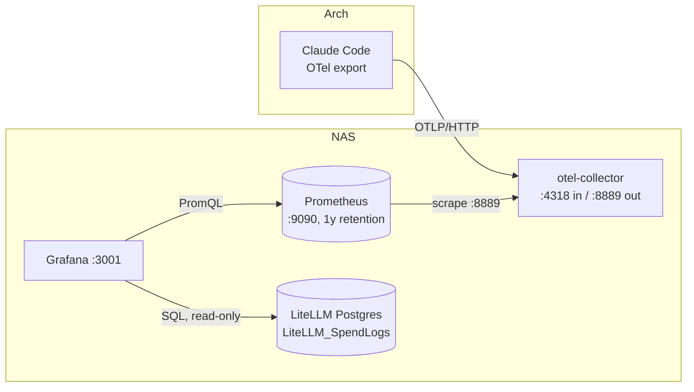

# Grafana Usage Metrics on the NAS — Design Spec

- **Date:** 2026-05-22
- **Status:** Approved (design phase) — implementation not started
- **Owner:** DerTechie
- **Relationship to other specs:** Complements [`2026-05-22-langfuse-observability-design.md`](2026-05-22-langfuse-observability-design.md). Langfuse gives **per-request traces** (qualitative drill-down); this adds **time-series usage/cost metrics** (quantitative dashboards). Together they are the two halves of the observability story.

## 1. Purpose & goals

Stand up **Grafana** on the NAS to collect and visualize **usage/cost over time**, started **now** so a real historical baseline accrues before the n8n phase and before any talk. Two data sources:

- **Gateway usage/cost** — spend vs the €100 cap, tokens/requests by route, local-vs-cloud split, latency. Sourced from data LiteLLM **already writes** to its Postgres, so dashboards show history from day one.
- **Claude Code subscription usage** — `claude_code.token.usage` and estimated `claude_code.cost.usage`, so the **"Max-subscription estimated-$ vs gateway API actual-$"** comparison has history by talk time. Requires starting Claude Code's telemetry collection now.

**Success criteria:**
- Grafana reachable on the LAN with both data sources healthy.
- Gateway dashboard shows real spend from existing `LiteLLM_SpendLogs` rows.
- After one Claude Code session, its tokens/cost appear on the Claude Code dashboard.
- All collection on-LAN; no recurring license cost.
- Decision + rejected options captured in `docs/journal/`.

**Non-goals (deferred, noted not built):** routing Claude Code *traces* to Langfuse via the same collector; n8n; nginx-proxy-manager fronting; alerting/notifications.

## 2. Key finding that shapes the design

**LiteLLM's Prometheus `/metrics` endpoint is an Enterprise (paid) feature** — confirmed in LiteLLM's docs ("Enterprise LiteLLM Only" on the `callbacks: ["prometheus"]` config). The earlier assumption that LiteLLM emits Prometheus metrics natively/for-free was wrong.

**Consequence / chosen path:** do **not** pay for LiteLLM Enterprise and do **not** use a Prometheus path for gateway data. Instead, read gateway usage/cost straight from the data LiteLLM **already persists** to its Postgres (`LiteLLM_SpendLogs`, written by default when a DB is configured). This is free, requires no new collection, and exposes the *actual* spend records. Prometheus is introduced **only** for Claude Code, whose telemetry has no other home.

## 3. Architecture & components

One new Dockge stack on the NAS, `nas/metrics/`, three light containers, **LAN-only**:

```
nas/metrics/  (Dockge stack)
├── otel-collector   :4318 OTLP/HTTP (published to LAN)   receives Claude Code telemetry
│                    :8889 (internal)                     exposes it as Prometheus metrics
├── prometheus       :9090 (internal)                     scrapes the collector; long retention
└── grafana          :3001 (published to LAN)             the dashboards
```

Grafana host port is **`:3001`** because Langfuse already owns host `:3000`.

### Data flow



- **Path 1 — Gateway (no new collection):** Grafana queries `LiteLLM_SpendLogs` directly. Cross-stack access without touching the live gateway: the metrics stack's Grafana **attaches to the gateway stack's existing Docker network as `external`** and reaches `litellm-db:5432` by service name. A **read-only Postgres role** is created for Grafana (one-time SQL) so a dashboard can never write.
- **Path 2 — Claude Code (start now):** Claude Code (Arch) pushes OTLP → collector (NAS) → Prometheus scrapes the collector's `:8889` Prometheus exporter → Grafana. The collector's Prometheus exporter normalizes temporality so Prometheus counters behave despite Claude Code being a bursty, short-lived CLI.

### Why this shape (rejected alternatives)
- **LiteLLM Enterprise Prometheus** — rejected: recurring cost for a solo setup when the SpendLogs Postgres data is free and is the real billing record.
- **Grafana → Langfuse ClickHouse for gateway cost** — rejected: couples to Langfuse's internal schema; SpendLogs is the cleaner, purpose-built cost source.
- **Claude Code → Prometheus OTLP receiver directly (no collector)** — rejected: a bursty CLI emitting cumulative counters that reset per session is rough against Prometheus's pull model; the collector handles temporality cleanly, decouples Claude Code from Prometheus, and is the single egress that can *later* also forward Claude Code traces to Langfuse. (Anthropic's own Claude Code monitoring docs use a collector.)

## 4. Claude Code configuration (Arch side, user-set)

Not a container — environment variables Claude Code reads, set once in the shell profile so every session reports (exact values finalized in the plan against current Claude Code docs):

```bash
CLAUDE_CODE_ENABLE_TELEMETRY=1
OTEL_METRICS_EXPORTER=otlp
OTEL_EXPORTER_OTLP_PROTOCOL=http/protobuf
OTEL_EXPORTER_OTLP_ENDPOINT=http://10.63.0.2:4318
OTEL_EXPORTER_OTLP_METRICS_TEMPORALITY_PREFERENCE=cumulative
```

Emits `claude_code.token.usage` (exact counts) and `claude_code.cost.usage` (estimated $ on the flat-rate Max subscription) plus session/activity counters. Works on the subscription (independent of the gateway, which the subscription cannot be proxied through).

## 5. Configuration, secrets, provisioning

- **`.env` gitignored, `.env.example` committed** (same pattern as the other NAS stacks). Secrets: `GRAFANA_ADMIN_PASSWORD`, `GRAFANA_DB_RO_PASSWORD` (the read-only Postgres role).
- **Grafana provisioned as code** (reproducible, no hand-clicking): `provisioning/datasources/*.yaml` (Prometheus + the read-only Postgres) and `provisioning/dashboards/*.yaml` + dashboard JSON.
- **Prometheus** config `prometheus.yml` (scrape the collector) + retention flag `--storage.tsdb.retention.time=1y` for talk-length history.
- **Collector** config `otel-collector-config.yaml`: OTLP receiver (HTTP `:4318`, gRPC `:4317`) → `prometheus` exporter on `:8889`.
- **Read-only DB role:** one-time SQL via the running gateway Postgres, e.g. a `grafana_ro` role with `GRANT SELECT` on the LiteLLM schema. Recommended over reusing the LiteLLM superuser.

## 6. Network exposure

- **LAN-only.** Published to the LAN: Grafana `:3001` and the collector's OTLP `:4318` (so Claude Code on Arch can push). Prometheus `:9090` and the collector's `:8889` stay internal to the stack network. No nginx-proxy-manager. *(Optional later: NPM for a clean Grafana URL.)*

## 7. Dashboards

Defined as JSON in the repo, provisioned on boot:

- **Gateway** (Postgres `LiteLLM_SpendLogs`): 30-day total spend vs the **€100 cap** and the `main` $50 / `deep` $35 / `deep-fallback` $15 sub-caps; spend over time; requests & tokens by route; **local (`private`/`aux-local`) vs cloud (`main`/`deep`) split**; latency derived from `startTime`/`endTime`.
- **Claude Code** (Prometheus): tokens and estimated-$ over time by model; session count. Headline panel: **Claude Code estimated-$ (subscription) vs gateway actual-$ (API)** combining both data sources — the talk money-shot.

## 8. Deployment

Same pattern as the Langfuse/LiteLLM stacks:
1. Stack dir on a **NAS pool path** (TrueNAS system dataset is read-only). Place `docker-compose.yml`, the provisioning/config files, and a filled `.env`.
2. Create the read-only Postgres role (one-time SQL against the running gateway Postgres).
3. Start the stack from Dockge.

## 9. Verification (evidence before "done")

1. Grafana loads at `http://10.63.0.2:3001`; both data sources test green.
2. Gateway dashboard renders **real** spend from existing `LiteLLM_SpendLogs` rows (proves the read-only Postgres path).
3. Run one Claude Code session on Arch with the telemetry env set; confirm `claude_code_*` series appear in Prometheus and the Claude Code dashboard populates (proves the OTLP → collector → Prometheus → Grafana path end to end).

## 10. Documentation (same change)

- `nas/metrics/README.md` (deploy + operate; the Arch-side Claude Code env snippet).
- Root `README.md`: observability = Langfuse (traces) **+** Grafana (usage/cost metrics).
- `docs/runbook.md`: operate/verify Grafana, the two data sources, the Claude Code env, the cross-stack network + read-only role facts.
- Journal entry: the LiteLLM-Prometheus-is-enterprise finding and the free Postgres path; why the OTel collector; the cross-stack `external` network choice; the deferred CC-traces-to-Langfuse idea.

## 11. Open items to verify during implementation

- Exact current Claude Code OTel env var names/values and metric names (`claude_code.token.usage`, `claude_code.cost.usage`) against current docs; confirm cumulative temporality is honored.
- The gateway stack's actual external Docker network name (depends on its Dockge stack dir) for Grafana to join.
- Confirm `LiteLLM_SpendLogs` is populated (spend logging not disabled) and its column names for the dashboard SQL.
- Pin image tags: `grafana/grafana`, `prom/prometheus`, `otel/opentelemetry-collector-contrib`.
- Collector exporter choice: `prometheus` (scrape) vs `prometheusremotewrite` — default to the scrape exporter unless a reason emerges.
