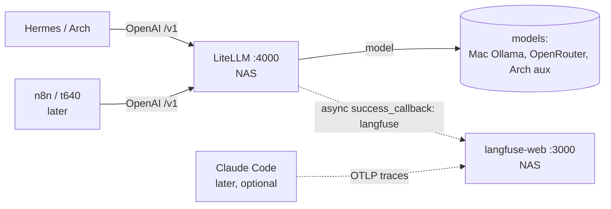

# Langfuse Observability on the NAS — Design Spec

- **Date:** 2026-05-22
- **Status:** Approved (design phase) — implementation not started
- **Owner:** DerTechie
- **Implements:** Phase 3 of [`2026-05-20-hybrid-ai-routing-design.md`](2026-05-20-hybrid-ai-routing-design.md) §11 ("Langfuse on the NAS").

## 1. Purpose & goals

Upgrade observability from LiteLLM's built-in spend dashboard to **per-request
tracing** with Langfuse, self-hosted on the NAS. Goals:

- **See individual prompts and responses** — open any request and inspect the
  exact prompt, completion, route taken, tokens, latency, and tool calls. This is
  the capability the LiteLLM dashboard lacks and the reason to build now: it
  serves both *talk material* (concrete real examples beat aggregate charts) and
  the spec's triage-advisor trust-building (§11.2 — "was the recommendation
  right?" is prompt-level review).
- **One observability + cost surface for all LLM usage.** Because every caller
  (Hermes now, n8n later) goes through the LiteLLM gateway, a single Langfuse
  callback captures all of it and it all counts against the same budget caps.
- **Keep all trace content on the LAN.** Traces capture full prompt/completion
  content, including the privacy-motivated `private` (local) route. Self-hosting
  is what keeps that content off third-party servers — the decisive reason
  Langfuse Cloud was rejected.
- **Professional, recognizable artifacts** for talks and slide decks. Langfuse is
  the de-facto LLM-observability UI; its trace and cost views read as
  ecosystem-fluent on a slide.

**Non-goals (deferred, none block this):** Grafana cost-comparison dashboards
(the "Max-subscription estimated-$ vs API actual-$" slide — a metric, better
served by Prometheus/Grafana later); Claude Code OTLP trace wiring; n8n;
fronting Langfuse with nginx-proxy-manager.

## 2. Why Langfuse v3, self-hosted, on the NAS

Decisions reached during brainstorming, recorded here so they aren't relitigated:

- **Langfuse over alternatives** (Phoenix, Grafana-only, Helicone, Lunary,
  SigNoz, LangSmith/Datadog cloud). Langfuse is the only option that combines
  per-request prompt/response drill-down, cost dashboards, native LiteLLM
  integration, OTel-GenAI foundations, *and* recognizable polish for talks.
  Phoenix is lighter but less business/cost-flavored; Grafana shows aggregate
  metrics only and **never** individual prompt content; cloud options send
  content off-LAN.
- **v3 footprint accepted.** Self-hosted Langfuse is now a **6-container** stack
  (web, worker, Postgres, ClickHouse, Redis, MinIO/S3) — ClickHouse, Redis, and
  S3 became mandatory in v3; the old Postgres-only Langfuse is EOL. Heavier than
  the original design implied, but single-user load runs far below Langfuse's
  published production minimums, and resources are capped (§5).
- **Stays on the NAS, not the t640.** Langfuse (ClickHouse) is RAM-hungry; the
  t640 thin client is RAM-constrained. The NAS has the memory, a backup regime,
  and already hosts the gateway. (Co-location with the gateway is a convenience,
  not a requirement — ingestion is async and tolerates a LAN hop.) The opposite
  hardware/workload profile is exactly why n8n later goes to the t640 and
  Langfuse stays here.

## 3. Architecture & components

A **new, independent Dockge stack** at `nas/langfuse/`, separate from the
LiteLLM stack so each updates/restarts on its own.

```
nas/langfuse/  (Dockge stack)
├── langfuse-web       :3000   UI + API (the dashboard / screenshots)
├── langfuse-worker            async trace ingestion
├── postgres                   Langfuse's own metadata DB (dedicated)
├── clickhouse                 trace/observation store (RAM-heavy; capped)
├── redis                      ingestion queue
└── minio                      S3-compatible blob store (large payloads)
```

**Dedicated Postgres** (not the existing `litellm-db`): keeps the two stacks
independently restartable and backed-up; a second small Postgres is negligible
RAM next to ClickHouse.

### Data flow



- LiteLLM fires an **async `success_callback: ["langfuse"]`** to
  `langfuse-web:3000`. Fire-and-forget: adds no latency and never blocks a
  request even if Langfuse is down.
- n8n (later, on the t640) hits the same gateway → same traces, same budget caps,
  zero extra integration.
- Claude Code (later, optional) ships OTLP traces **directly** to `langfuse-web`
  over the LAN, bypassing the gateway (the Max subscription cannot be proxied
  through LiteLLM — see the side-research findings in the journal).

## 4. Configuration & secrets

- **`.env` gitignored, `.env.example` committed** — same pattern as the litellm
  stack. Secrets: Postgres / ClickHouse / Redis passwords, MinIO root
  credentials, and Langfuse's `NEXTAUTH_SECRET`, `SALT`, and `ENCRYPTION_KEY`
  (each generated via `openssl rand -hex 32`).
- **Headless init.** Use Langfuse's `LANGFUSE_INIT_*` env vars to auto-provision
  the org, project, initial user, and **project API keys** on first boot, so the
  public/secret keys are *declared in `.env`* rather than hand-clicked in the UI.
  This makes the stack reproducible and lets LiteLLM be wired in the same change
  instead of a manual bootstrap. (Exact `LANGFUSE_INIT_*` var names confirmed
  against the v3 docs at build time.)
- **LiteLLM wiring** (in the existing litellm stack):
  - `litellm-config.yaml`: add `success_callback: ["langfuse"]` under
    `litellm_settings`.
  - litellm stack env: add `LANGFUSE_PUBLIC_KEY`, `LANGFUSE_SECRET_KEY`, and
    `LANGFUSE_HOST=http://10.63.0.2:3000`, then restart the litellm stack.

## 5. Resource capping (NAS-crowding concern)

The NAS (32 GB) already runs immich, jellyfin, paperless, pihole, and the LiteLLM
stack. ClickHouse is the one to bound:

- ClickHouse: container memory limit (~2 GB) plus internal
  `max_server_memory_usage`.
- Modest limits on web/worker/redis/minio/postgres.
- **Realistic total at single-user trace volume: ~3–4 GB RAM**, protecting
  immich/jellyfin from contention.

## 6. Network exposure

- **LAN-only to start:** UI at `http://10.63.0.2:3000`, opened from the Arch
  browser. No nginx-proxy-manager in the path.
- Internal service ports (ClickHouse, Redis, MinIO, Postgres) bound to the NAS,
  not broadly published. `langfuse-web` reachable on the LAN so the gateway,
  future n8n, and Claude Code can all reach it.
- *Optional later:* front with the existing nginx-proxy-manager for a clean
  `langfuse.<domain>` URL (nicer screenshots). Not now.

## 7. Deployment

Same as the litellm stack:

1. Create a stack dir on a **NAS pool path** (TrueNAS system dataset is
   read-only). Place `docker-compose.yml`, a filled `.env` (from `.env.example`),
   and any mounted config in it.
2. Start the stack from Dockge.
3. Verify (§8).

## 8. Verification (evidence before "done")

1. Stack healthy in Dockge (all six containers up, health checks passing).
2. Langfuse UI loads at `http://10.63.0.2:3000` and login works.
3. **End-to-end acceptance test:** fire a real request through the gateway
   (`http://10.63.0.2:4000`) and confirm the trace appears in Langfuse with the
   correct prompt, response, token counts, and cost. Containers-up is *not*
   sufficient; the trace round-trip is the acceptance criterion.

## 9. Documentation (same change)

- New `nas/langfuse/README.md` (deploy + operate the stack).
- Update root `README.md`: observability is now Langfuse (per-request traces),
  LiteLLM dashboard demoted to a fallback view.
- Update `docs/runbook.md`: operate/verify Langfuse, the LiteLLM→Langfuse
  callback wiring, the end-to-end trace check.
- **Journal entry** capturing the decision story for the talk: why Langfuse v3,
  the 6-container footprint tradeoff and what was rejected (Phoenix, Grafana-only,
  cloud), why it stays on the NAS while n8n goes to the t640, and the Claude Code
  subscription-can't-be-proxied finding (with the OTLP-direct path noted for
  later).

## 10. Open items to verify during implementation

- Exact `LANGFUSE_INIT_*` env var names for headless org/project/key
  provisioning in the current v3 release.
- The current pinned image tags for `langfuse/langfuse` and
  `langfuse/langfuse-worker` (use `:3` major or a pinned minor).
- ClickHouse memory-limit knob names current for the shipped ClickHouse image.
- Confirm LiteLLM's Langfuse callback env var names
  (`LANGFUSE_PUBLIC_KEY`/`LANGFUSE_SECRET_KEY`/`LANGFUSE_HOST`) against the
  installed LiteLLM `main-stable`.

## 11. Success criteria

- A real gateway request is visible in Langfuse as a trace with prompt,
  response, tokens, and cost.
- All trace content stays on the LAN (no external service).
- The Langfuse stack runs within its resource caps without starving existing NAS
  services.
- The decision and footprint tradeoff are captured in `docs/journal/`.
- Langfuse is LAN-reachable so future n8n (t640) traces require no rework.
